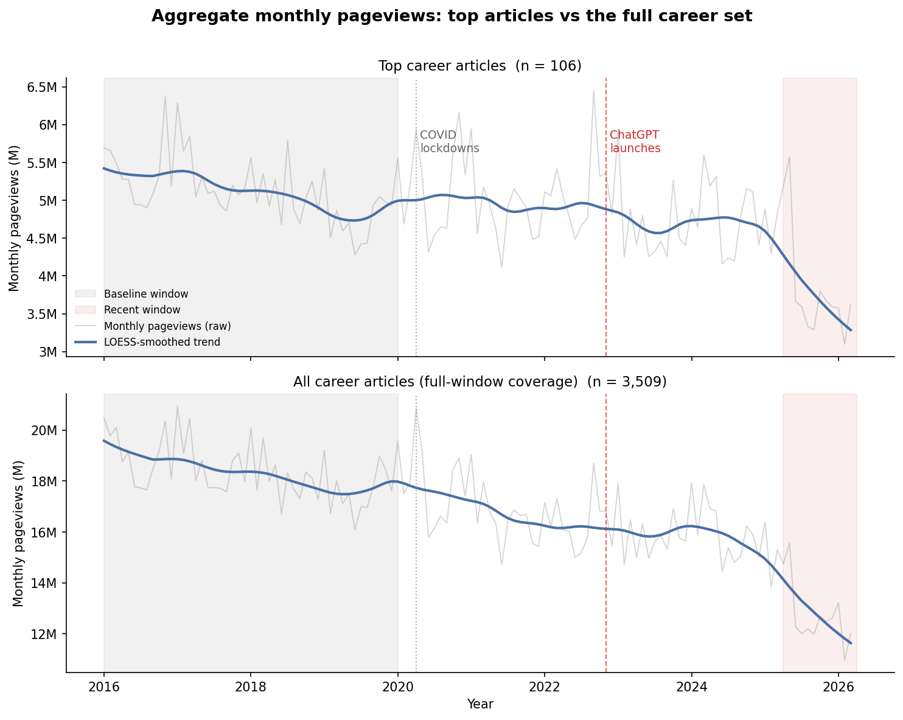
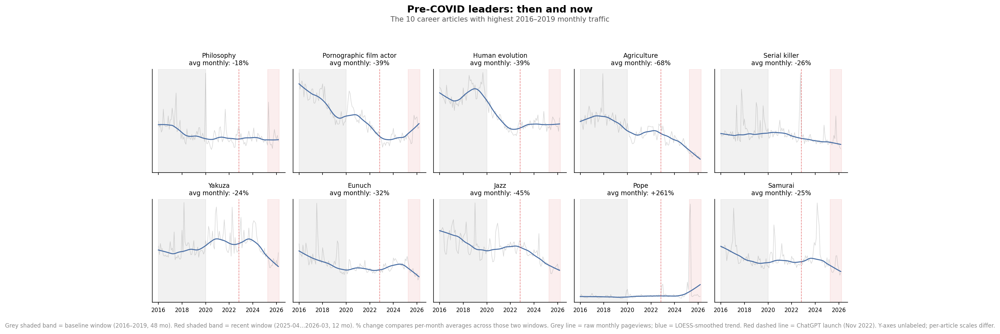
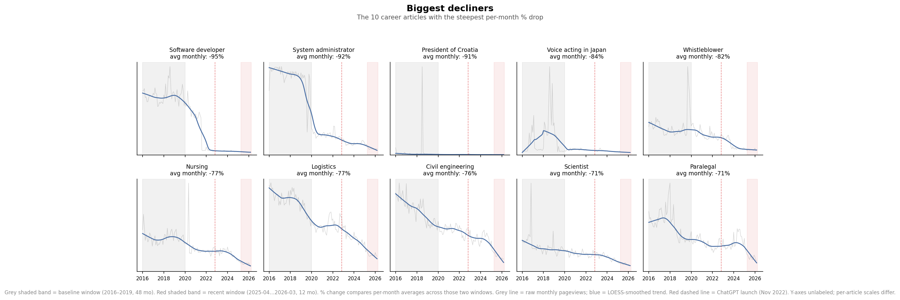
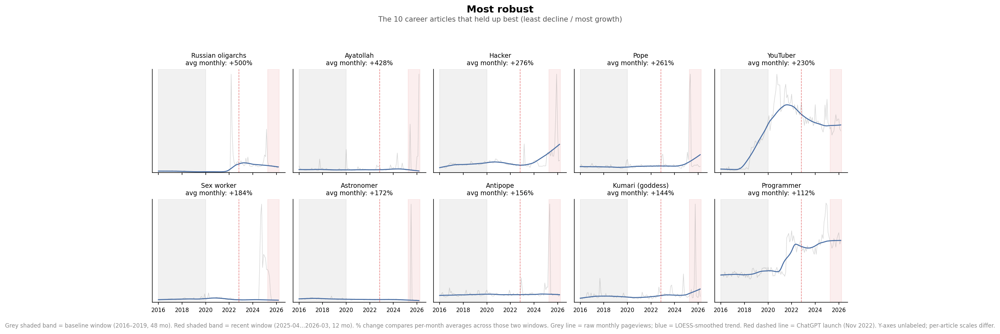

# Career articles on Wikipedia: some scary numbers

TLDR: career articles have lost a median of 28% of their monthly pageviews since pre-COVID (more for the most-read articles), and the decline sharply accelerated in late 2025/early 2026.

## Why this data set?

About a decade ago I worked for a while to improve the diversity of images in "career" articles on Wikipedia—lawyer, judge, chef, etc.—because I thought, having just had a child, it was a good thing for children reading about "being a lawyer" to see a much more representative set of images than were in that article at the time. (When I talk about this, I usually point out that every picture in Prime Minister featured Churchill. [It is better now](https://en.wikipedia.org/wiki/Prime_minister).) 

Unfortunately the original wikidata query I used for that work is lost, but I reconstructed it recently. In short, the list contains any English Wikipedia article that is listed as an "occupation" in Wikidata, with lots of noise filtered out by ensuring that the occupation is actually applied to at least some people items in Wikidata. That yields about 4,000 entries, ranging from the obvious (Lawyer, Software developer) through edge cases (Pope, Comfort women). 

When I looked again in 2025 after not looking for nearly a decade, the numbers looked weird, but I did not dig into them much.

But Friday I saw Martin Monperrus's [quick "decline of Wikipedia" analysis](https://github.com/monperrus/wikipedia-decline-llm) and so decided to run a similar analysis on this "pet" data set of mine.

**Strong disclaimer here: this data set is not particularly representative of English Wikipedia as a whole.** Nor is it a particularly perfect data set, because Wikidata's usage of some of these categories is... weird at best. But nevertheless it is a data set that is near and dear to me because of that past work—I'm proud that a million people have seen a more representative vision of "Judge" [since I improved the lead picture there in 2018](https://en.wikipedia.org/w/index.php?title=Judge&direction=next&oldid=865940653), for example.

As a quick and dirty categorization, I did most analyses on the whole set and a "top" set—those that had ranked in the top-50 by pageviews in any year from 2016–2025, which netted out to 106

## The bottom line

In the "top articles" data set, the median article is down 34% relative to a pre-COVID 2016-2019 baseline. Much of that has happened in the past year: from April 2025-March 2026, the loss was **20.9%** in readership compared to the previous year. In just one year.

The larger data set's numbers aren't quite as bad (28% overall loss, instead of 34%), but the aggregate monthly traffic trend is basically the same for both top articles and the overall data set: a COVID-era bump, a slow drift lower through 2022–2024, then a sharp step-down starting in 2025. 

In the graph, the two shaded bands mark the windows being compared: grey is 2016–2019 (48 months), red is the most recent rolling year (2025-04 through 2026-03, 12 months).

## What happened to the top articles

Of the 10 career articles that had the highest monthly traffic pre-COVID, almost every one is down 20–65%. The only outlier up is Pope, driven entirely by 2025 news (and likely back to pre-news trendline). Philosophy is another exception also held up better than most, possibly because the underlying questions ("what is Stoicism?") are more open-ended and harder for an LLM to definitively answer than "what does a software developer do?"

## What collapsed

The biggest decliners are strikingly uniform: they're "how do I do this job" reference articles in exactly the domains where a chatbot is the natural substitute.

In each table below, *Pre-COVID /mo* is the average monthly pageviews over the 2016–2019 baseline window; *Recent /mo* is the average over the 2025-04..2026-03 rolling year; *%* is the change in per-month averages between those two windows.

| Article | Pre-COVID /mo | Recent /mo | % |
|---|---:|---:|---:|
| Software_developer | 43,692 | 2,110 | **−95%** |
| System_administrator | 61,712 | 4,923 | **−92%** |
| Whistleblower | 48,602 | 8,541 | **−82%** |
| Nursing | 45,817 | 10,523 | **−77%** |
| Logistics | 67,154 | 15,549 | **−77%** |
| Civil_engineering | 82,893 | 20,119 | **−76%** |
| Scientist | 35,720 | 10,211 | **−71%** |
| Paralegal | 41,183 | 11,985 | **−71%** |

(One real caveat: Software_developer's traffic appears to have partly migrated to the Programmer article, which shows up in the *robust* list below — so some of that −95% is page-consolidation, not pure demand collapse. The aggregate still declines either way.)

## What held up the best?
About 9% of articles (323 of 3,509) had significant readership growth from pre-covid to the last year. However, 80% of those were extremely small articles, with pre-COVID baselines under 1,000 views/month.

Only 10 articles with meaningful pre-COVID traffic (10,000+/mo) more than doubled, and nearly all of those are news-cycle events (Pope, Ayatollah, Antipope, Russian oligarchs, Monsignor) or cultural-moment shifts (Hacker, Sex worker, YouTuber). The one arguable exception is Programmer (+112%), and even there a chunk is probably redirect churn from Software developer. 

In other words, organic, non-news-cycle growth in career-article reading is somewhere between rare and absent.

## Caveats

    - **Correlation isn't causation.** The 2025 cliff coincides with broad LLM adoption, but it also coincides with referrer-mix changes (more social, less organic search), a likely shift in search-engine answer panels that reduce click-through to Wikipedia, and possibly other factors.
    - **Redirect churn is real.** The Software_developer → Programmer shift above is one visible instance; there are probably more subtle ones. I made very little effort to correct these.
    - **These are only career articles.** Again, this doesn't say anything about Wikipedia overall, nor about the much larger set of informational topics Wikipedia covers. But does point to the sort of analysis we could be doing to spot larger trends.

## How this was built

- ~4,000 career article titles pulled from Wikidata (property P106 / "occupation"), filtered to items whose `instance of` matched profession-related classes.
- Monthly pageviews fetched from the Wikimedia Pageviews REST API with `agent=user` (bot-filtered), 2016-01 through 2026-03.
- Ranked top-50 per year by within-set pageviews; the 108 articles that hit the top 50 in any year form the "ever-top" set.
- Filtered to 106 articles with complete coverage in both windows (48 baseline months = 4 full years, 12 recent months = 1 full year); compared per-month averages. Window endpoints are aligned so each calendar month appears the same integer number of times in each window, eliminating residual seasonal bias.
- Monthly-series charts show raw data in grey with a [LOESS](https://en.wikipedia.org/wiki/Local_regression) smoothed trend overlaid in blue (span 0.15 for the aggregate chart, 0.25 for small multiples).

Source code and fetch scripts live at [tieguy/career-images `analysis/career-cliff/`](https://github.com/tieguy/career-images/tree/main/analysis/career-cliff). Per-article CSV output at `output/decline_summary.csv` in the same directory.
