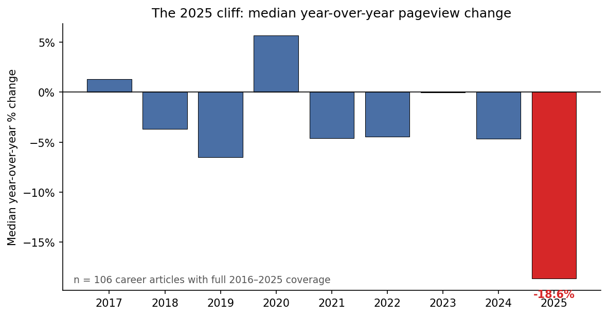
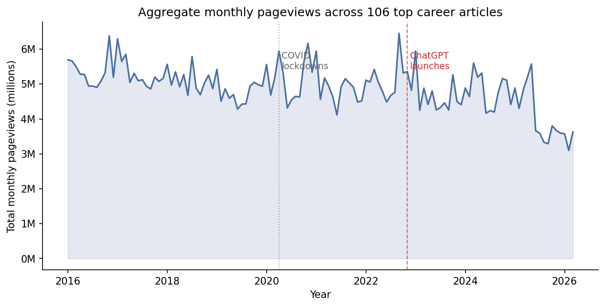
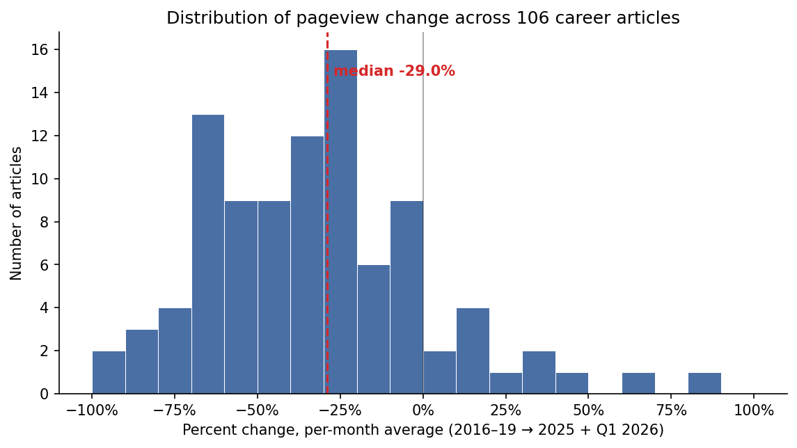
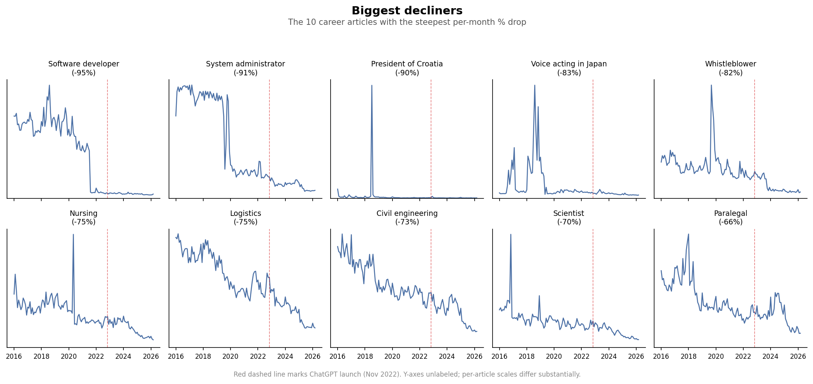
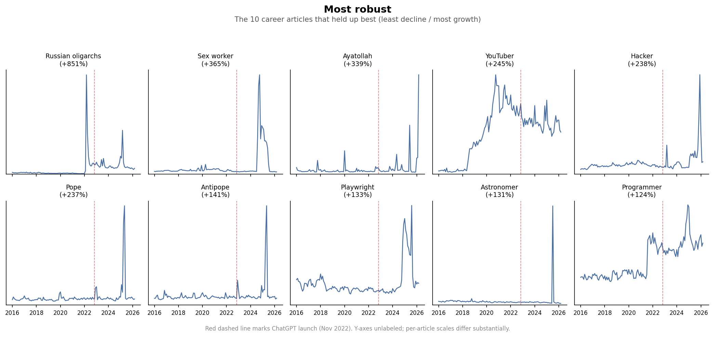
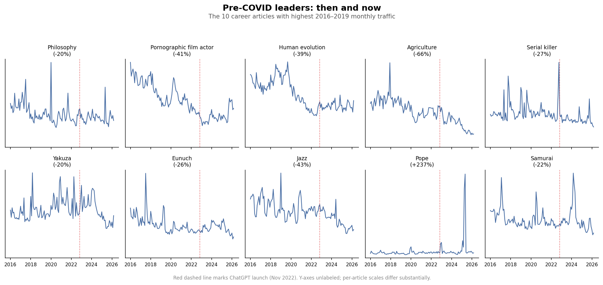

# Career articles on Wikipedia: the 2025 cliff

A companion analysis to Martin Monperrus's [wikipedia-decline-llm](https://github.com/monperrus/wikipedia-decline-llm), narrowed to the ~4,000 English Wikipedia articles about jobs and careers.

The short version: **career articles have lost a median of 29% of their monthly pageviews since pre-COVID**, and the decline sharply accelerated in 2025.

## What jumped out

For most of 2016–2024 the median career article lost a few percent of pageviews per year, or held roughly steady. In 2025 the median article lost **18.6%** in a single year — roughly 4× the prior pace, and the biggest annual drop in the whole 10-year series.

Aggregate monthly traffic across the top 106 articles shows the same shape: a COVID-era bump, a slow drift lower through 2022–2024, then a sharp step-down through 2025 and Q1 2026.

In the 2022–2025 window we measured earlier, the top quartile of articles was still growing (P75 = +26%). With the recent window shifted to 2025 + Q1 2026, **even the top quartile is now declining** (P75 = −3%). Growth has essentially vanished from this set.

## What held up, what collapsed

The biggest decliners are strikingly uniform: they're "how do I do this job" reference articles in exactly the domains where a chatbot is the natural substitute.

| Article | Pre-COVID /mo | 2025 + Q1 2026 /mo | % |
|---|---:|---:|---:|
| Software_developer | 43,692 | 2,193 | **−95%** |
| System_administrator | 61,712 | 5,610 | **−91%** |
| Whistleblower | 48,602 | 8,773 | **−82%** |
| Nursing | 45,817 | 11,241 | **−76%** |
| Logistics | 67,154 | 16,926 | **−75%** |
| Civil_engineering | 82,893 | 22,460 | **−73%** |
| Scientist | 35,720 | 10,625 | **−70%** |
| Paralegal | 41,183 | 13,944 | **−66%** |

(One real caveat: Software_developer's traffic appears to have partly migrated to the Programmer article, which shows up in the *robust* list below — so some of that −95% is page-consolidation, not pure demand collapse. The aggregate still declines either way.)

The articles that held up best — or outright grew — are a completely different kind of thing:

| Article | Pre-COVID /mo | 2025 + Q1 2026 /mo | % |
|---|---:|---:|---:|
| Russian_oligarchs | 3,560 | 33,871 | **+851%** |
| Sex_worker | 36,649 | 170,480 | **+365%** |
| Ayatollah | 18,024 | 79,098 | **+339%** |
| YouTuber | 9,648 | 33,264 | **+245%** |
| Hacker | 34,491 | 116,495 | **+238%** |
| Pope | 88,442 | 297,831 | **+237%** |
| Playwright | 11,799 | 27,494 | **+133%** |
| Astronomer | 12,052 | 27,801 | **+131%** |
| Programmer | 19,942 | 44,696 | **+124%** |

These are driven by news cycles (Russian_oligarchs and Ayatollah after 2022; Pope Francis's death and the 2025 conclave), cultural relevance shifts (YouTuber, Sex_worker, Hacker), or page-redirect churn (Programmer). What they mostly are *not* is "how do I do this job" reference lookups.

Looking at the 10 career articles that had the highest monthly traffic pre-COVID makes the pattern especially clear: almost every one is down 20–65%, and the only outlier up is Pope, driven entirely by 2025 news. Philosophy — a genuinely informational topic — is down 20% but held up better than most, probably because the underlying questions ("what is Stoicism?") are more open-ended and harder for an LLM to definitively answer than "what does a software developer do?"

## Caveats

- **Correlation isn't causation.** The 2025 cliff coincides with broad LLM adoption, but it also coincides with referrer-mix changes (more social, less organic search), a likely shift in search-engine answer panels that reduce click-through to Wikipedia, and possibly other factors.
- **Redirect churn is real.** The Software_developer → Programmer shift above is one visible instance; there are probably more subtle ones.
- **These are only career articles.** This doesn't say anything about Wikipedia overall, nor about the much larger set of informational topics Wikipedia covers.
- **Per-article noise is high.** Aggregate medians are robust but any single article's trend can be driven by something idiosyncratic (a news cycle, a renaming, a referenced film).

## How this was built

- ~4,000 career article titles pulled from Wikidata (property P106 / "occupation"), filtered to items whose `instance of` matched profession-related classes.
- Monthly pageviews fetched from the Wikimedia Pageviews REST API with `agent=user` (bot-filtered), 2016-01 through 2026-03.
- Ranked top-50 per year by within-set pageviews; the 108 articles that hit the top 50 in any year form the "ever-top" set.
- Filtered to 106 articles with complete coverage in both windows (48 baseline months, 15 recent months); compared per-month averages to keep the windows comparable despite different lengths.

Source code and fetch scripts live at [tieguy/career-images `analysis/historical-decline/`](https://github.com/tieguy/career-images/tree/main/analysis/historical-decline). Per-article CSV output at `output/decline_summary.csv` in the same directory.
